# Online Resume Builder

A web based online resume builder where users can fill their details and can generate resumes based on pre- defined templates.

We have created a web based online resume builder where users can fill their details and can generate resumes based on pre- defined templates. The resume can be generated in two ways -
1) **with login** : If a user is logged in , then the details of the user will be saved in the database. The main advantage of this feature is , next time a user will create a resume using any other template/ details , then he/she will not be required to fill in the details again. The user will get pre-filled details in the form. 
2) **without login** : We respect the privacy of our user and we understand the user doesn't want to share their personal details all the time. Hence we have given an option to the user to create a resume without signing up / logging in for our service. But in that case we won’t be able to save user details in the database and next time if the user wants to create a resume again , they will be required to fill in the details again.

 

----
### This website can be accessed using the below given URL : 
[http://surajchy.tech/resumeBuilder/frontend/core/home.html](http://surajchy.tech/resumeBuilder/frontend/core/home.html)

   

### Detailed video demonstration of project , used azure services , deployment ,etc..
[https://drive.google.com/file/d/1JnA-u3eu5FnHrqcxmHusQPFW9tpvvsGb/view?usp=sharing](https://drive.google.com/file/d/1JnA-u3eu5FnHrqcxmHusQPFW9tpvvsGb/view?usp=sharing)

   

## Project Demo & screenshots
----
  
  
- You can access the landing page using the above mentioned URL. The site is fully responsive and can be smoothly accessed on mobile devices as well.
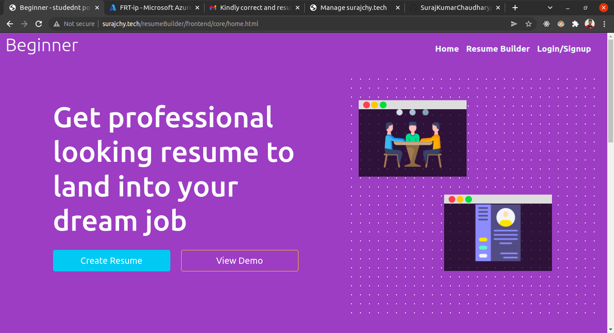 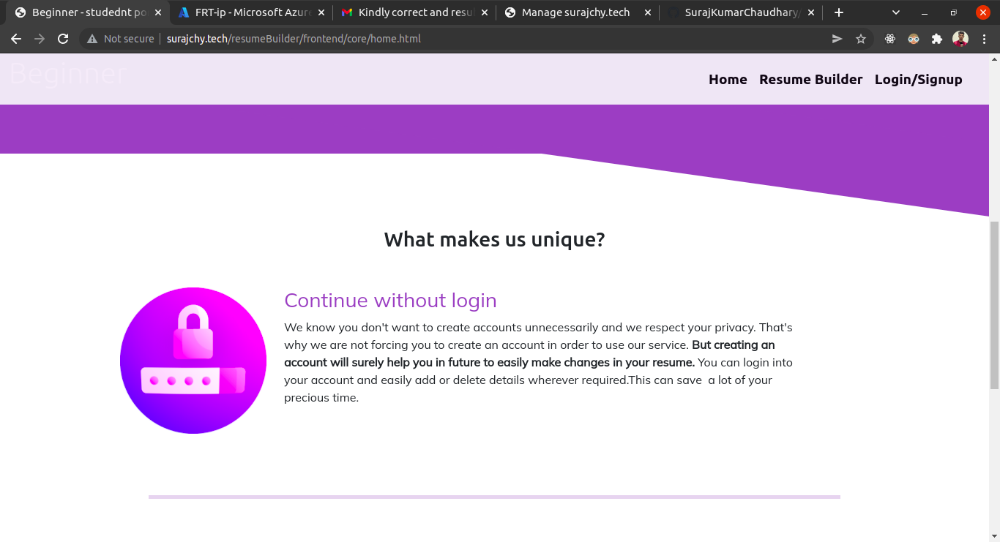  

  

- If you want to login/signup before creating resume then you can navigate to the login/signup section from the navigation bar available on the top of screen.
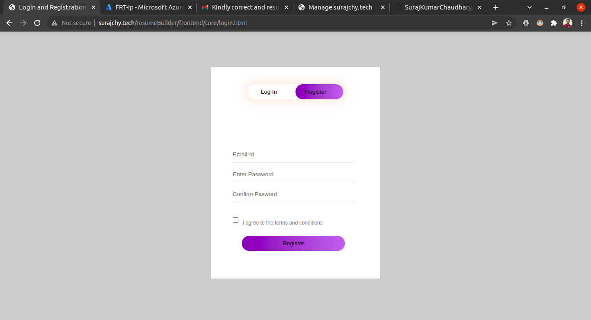  

      

- To continue with the resume creation process , you can either click on **create resume** button or can select the same option from the navigation bar. 
  This willmove you to the next page where you can select your preferred resume template.
  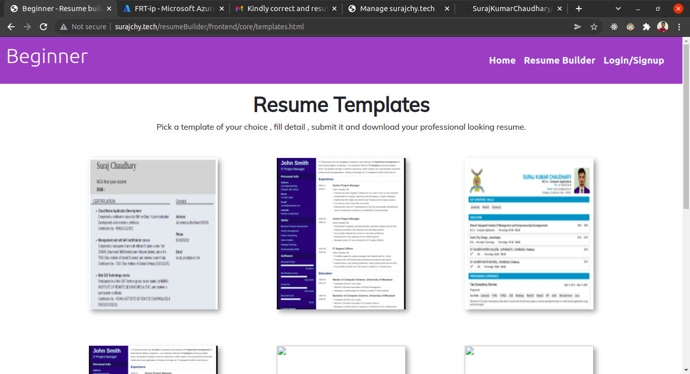  
    
      
    
 - After selecting your preferred resume template on the next page you will get a form to fill all the details required to create your resume. If you are selectng 
   template after logging into the service then you will get pre-filled details if you have already used this servicec before.
   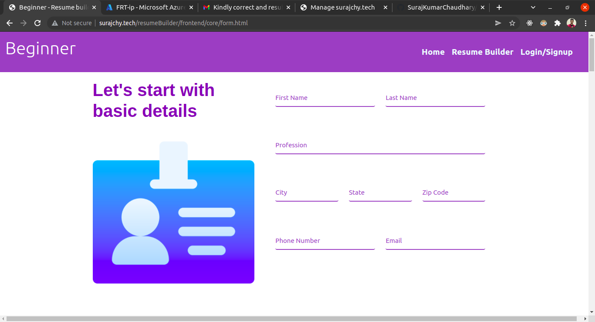  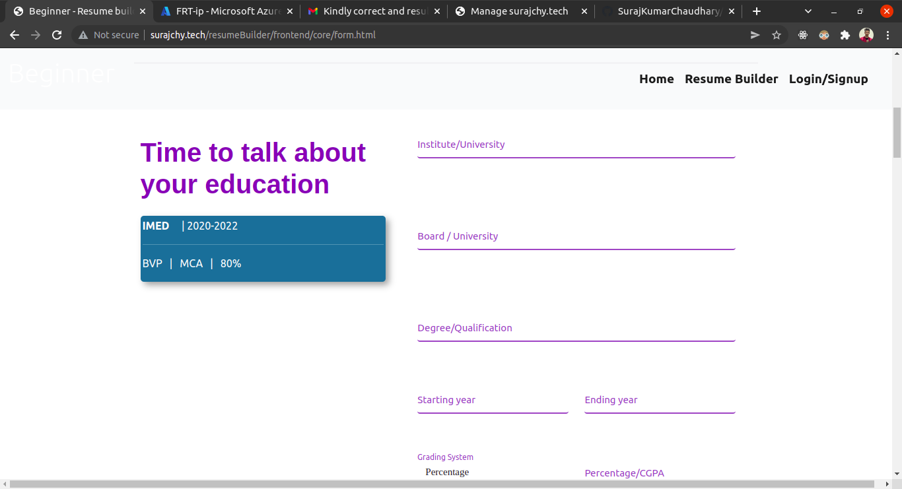  
     
       
     
 - After filling all the details , you can click on **Create Resume** button. This will redirect you to the next page where you can get preview your resume and download 
   a PDF version of your resume.
   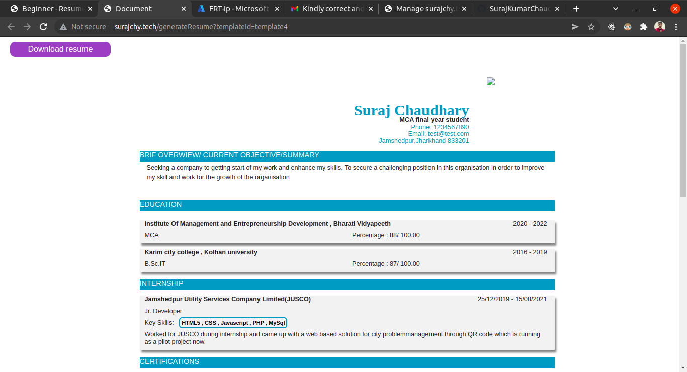  
     
  
    
  
  
### How Microsoft azure services used in this project
----
 

Azure Services used
- Azure virtual machine
- Azure DNS Zone
- Azure public IP address
  
    
  
I have used Microsoft azure for deployment of this project. The project is hosted on Azure linux virtual machine(VM) with standard B1s configuration. 
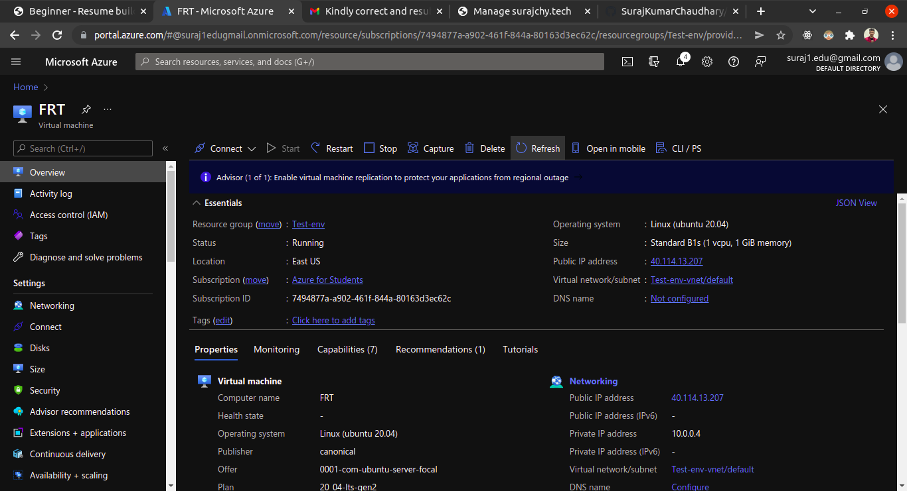

    
  
The virtual machine can be accessed using different ways but for linux VMs SSH is the most common approch. I have tried to connect to the VM using the SSH command provided by azure for SSH connection.
The VM is configued with all the required softwares and dependencies to run this service. Below are the list of softwares installed on VM in order to run the website -
 - nginx : for serving as reverse proxy for nodeJS.
 - NodeJS : server runtime
 - MongoDB : Database
 - PM2 : node process manager
 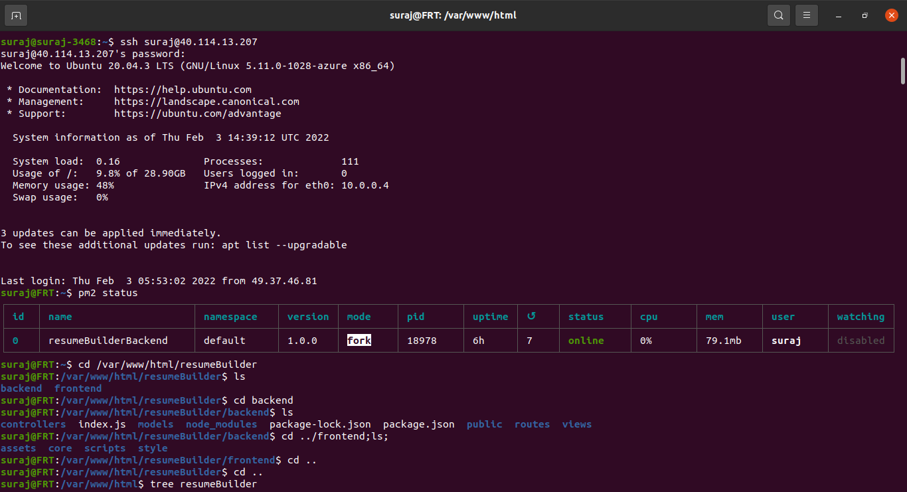
 
   
 
 Once VM is running with a configured web server, it can be accessed using the VM IP address. But to make it more user firendly and easy to access ,we should 
 alway connect the VM with a domain/subdomain. Fortunately azure provides a serivce called **DNS zone** which allows us to configure a domain and connect it with
 other azure services such as azure virtual machine. I have used the same servicec (i.e DNS zone ) to configure my DNS and connect it with my VM.
 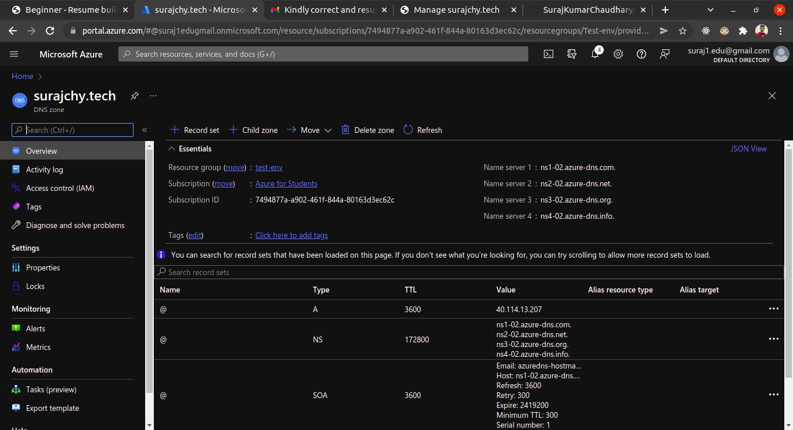
 
 
   
 
 One of the very important step is register our host name server to domain service provider. As  I  am using Microsoft Azure to host my application. So I have to 
 register azure's dns in my domain service provider nameserver. 
  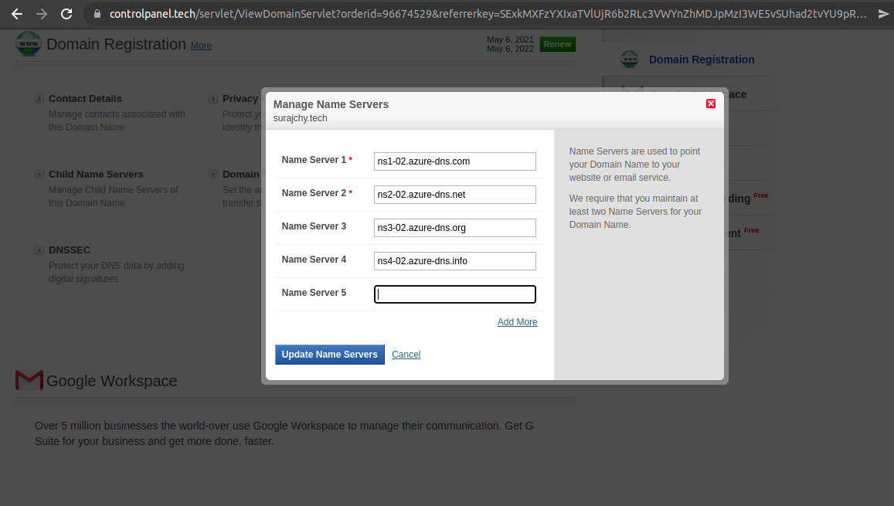
  
     
   
  At this point we are ready with our running application which can be easily accessed using our domain name. But here comes one of the most important step which we 
  should never forget.  
  By default azure assigns a dynamic IP address to virtual machine. It means once we stop/restart out VM then the IP address may change. But in order to keep our service 
  running all the time , it must be assigned with a static IP address which remains unchanged no matter how many times our VM reboot. For this we have to use another service 
  called **Azure public IP**. This service  will assign a static IP to our VM and the same IP can be mapped with our DNS.
 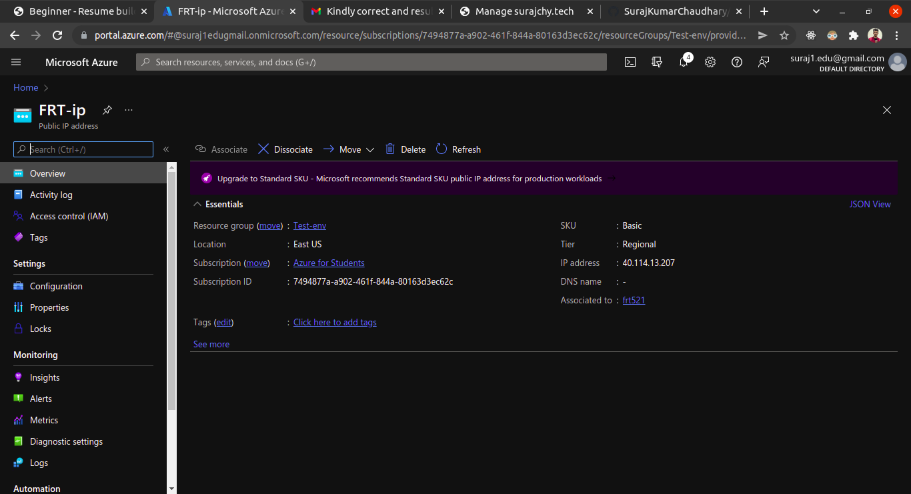
 
   
 
 We can verify that our domain name is point to the correct IP address (i.e. IP address of our Azure VM). To check this visit www.dnschecker.org. Enter your 
 website URL , select *A* record and click on search button. It will show you mapped IP address of that domain name in different regions.
 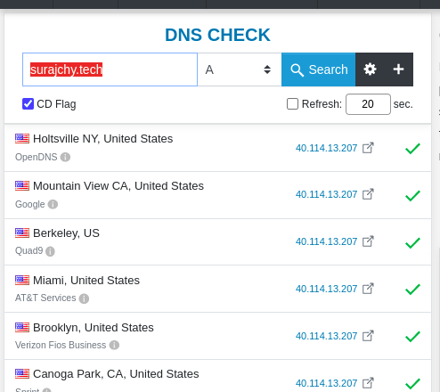
 
  
  
 Now we have reached at a point where our website is up & running and ready to serve our customers. I hope you liked my project. 
 Happy learning!! :slightly_smiling_face: :slightly_smiling_face:
  
 

